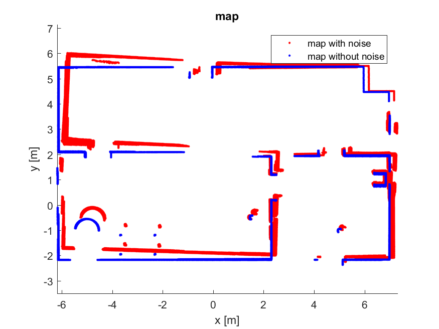

# Wheel Odometry-Based Mapping

This project is the solution to A1 of ROB521: Mobile Robotics and Perception taught at the University of Toronto. This assignment requires students to implement a wheel odometry algorithm to map a scene based on a series of measurements. See the file ass1.m for the implemented algorithms and see the file gazebo.mp4 to visualize the robot's scene.

# Part 1: Wheel Odometry Algorithm

In this part of the assignment a wheel odometry algorithm was implemented to predict the heading and
position of the robot based on noise-free measurements. Using the velocity measurements from the
previous frame, the x_odom, y_odom, and theta_odom values at each measurement iteration were
predicted. The odometry algorithm used to update the aforementioned values relies on the following
update formulae:

𝑥(𝑖) = 𝑥(𝑖 − 1) + 𝑐𝑜𝑠(𝑡ℎ𝑒𝑡𝑎_𝑜𝑑𝑜𝑚(𝑖 − 1)) ∗ 𝑣_𝑜𝑑𝑜𝑚(𝑖 − 1) ∗ (𝑡_𝑜𝑑𝑜𝑚(𝑖) − 𝑡_𝑜𝑑𝑜𝑚(𝑖 − 1))

𝑦(𝑖) = 𝑦(𝑖 − 1) + 𝑠𝑖𝑛(𝑡ℎ𝑒𝑡𝑎_𝑜𝑑𝑜𝑚(𝑖 − 1)) ∗ 𝑣_𝑜𝑑𝑜𝑚(𝑖 − 1) ∗ (𝑡_𝑜𝑑𝑜𝑚(𝑖) − 𝑡_𝑜𝑑𝑜𝑚(𝑖 − 1))  

𝑡ℎ𝑒𝑡𝑎_𝑜𝑑𝑜𝑚(𝑖) = 𝑡ℎ𝑒𝑡𝑎_𝑜𝑑𝑜𝑚(𝑖 − 1) + 𝑜𝑚𝑒𝑔𝑎_𝑜𝑑𝑜𝑚(𝑖 − 1) ∗ (𝑡_𝑜𝑑𝑜𝑚(𝑖) − 𝑡_𝑜𝑑𝑜𝑚(𝑖 − 1))

Plots were generated to measure the performance of the odometry algorithm versus the robobts true
position and heading. The following Figure illustrates the difference between the predicted path and heading versus the actual path and heading:

*Figure 1: Part 1 true path and heading versus predicted path and heading*

Since the measurements were not corrupted with any noise, we expect the difference between the
predicted and actual path and heading measurements to be very small. The error subplots show that both the positional error and the heading error remain below 0.02m and 0.025rad, respectively. The true path and heading versus the path and heading measured through odometry are so similar that the difference between the two cannot be observed for the majority of the path and heading plots.

# Part 2: Wheel Odometry Algorithm with Added Noise

In this part, random noise was added to the linear and angular velocity measurements. Then, the wheel
odometry algorithm from the previous part was applied to 100 simulations of noisy odometry data. The
results of the application of the previous algorithm to the noisy data is illustrated by Figure 2:

*Figure 2: Part 2 predicted path with added noise*

The blue line is the true path that the robot followed. The red paths are the odometry predictions for each
of the 100 noisy simulations. The difference between the predicted odometry and the actual odometry
increases as the robot progresses through the scene. Since wheel odometry is a dead reckoning method,
the variance grows without bound. This is demonstrated by the above Figure because the error in the
measurements grows as the robot continues to traverse the scene. 

# Part 3: Mapping Algorithm

In this part of the assignment, the sensor measurements were used to create a map of the scene. To accomplish this task, the x and y coordinates of each sensor measurement were calculated in the sensor frame. Then, these points were transformed back into the inertial frame using a transformation matrix. The structure of this transformation matrix is shown below:

*Figure 3: Transformation matrix used to transform points from the sensor frame to the inertial frame*

Two maps were created, a map using the noisy odometry measurements, and a map using the true
odometry values. These maps are shown below in Figure 3:

*Figure 4: Part 3 generated map with and without noise modelling*

The map created using noisy data is thicker than the map using pure data because the noise increases the
uncertainty in the robot’s position and has a direct impact on the transformation of the sensor values back
into the inertial frame. The thickness of the map increases as the robot travels because the uncertainty
propagates. Measurements that the robot observes later on his journey will be less accurate than earlier
measurements.
